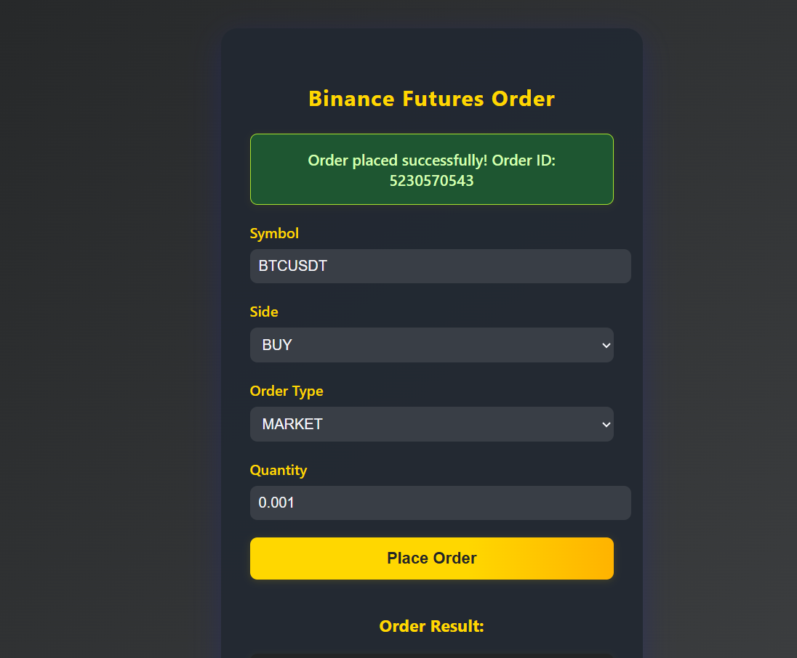

---

````markdown
# 📈 PrimeTrade AI - Binance Futures Trading Bot (with Web UI)

A full-stack crypto trading bot that allows users to **place Binance USDT-M Futures orders** (Market, Limit, and Stop-Market) via a **user-friendly web interface** built using **Flask**.

This project connects to the **Binance Futures Testnet**, making it safe for testing and experimentation.

---

## 🚀 Features

- ✅ Web-based UI to buy/sell crypto
- ✅ Supports Market, Limit, and Stop-Market orders
- ✅ Input validation and error handling
- ✅ Real-time Binance Testnet integration
- ✅ Order confirmation and status display
- ✅ Logging of all activity (API responses, errors, etc.)
- ✅ Runs securely using user-specific API keys (optional)

---

## 🛠 Tech Stack

| Layer       | Technology                  |
|-------------|-----------------------------|
| Backend     | Python                      |
| Frontend    | HTML/CSS, Flask             |
| Trading API | Binance Futures (Testnet)   |
| Library     | `binance-connector`         |
| Hosting     | Runs locally on port `5000` |

---


## 📸 Demo

> A quick demo of the trading interface in action:


### 🖥️ Web Interface (Home)


---

## 🧠 Project Structure

PrimeTrade AI Assignment/
├── .gitignore
├── frontend.py              # Flask app with routes & bot logic
├── bot.py                   # Main Bot logic
├── .env                     # API keys (not committed)
├── requirements.txt         # All dependencies
├── trading_bot.log          # Log file
└── README.md                # You're here
````

---

## ⚙️ How It Works

1. User accesses the bot via `http://localhost:5000`
2. UI collects:

   * Trading symbol (e.g., BTCUSDT)
   * Order type (Market, Limit, Stop-Market)
   * Side (Buy/Sell)
   * Quantity
   * Limit/Stop price (if applicable)
3. Flask validates input and sends it to Binance using `python-binance`
4. Binance executes the trade on **Testnet**
5. UI displays confirmation or error response
6. All logs saved to `trade_bot.log`

---

## 🧪 Testnet Setup

1. Register on: [Binance Futures Testnet](https://testnet.binancefuture.com)
2. Generate **API Key** and **Secret**
3. Fund your testnet wallet with mock USDT
4. Put keys into a `.env` file:

   ```
   API_KEY=your_testnet_api_key
   API_SECRET=your_testnet_api_secret
   ```

---

## 💻 Getting Started

### 1. Clone the Repo

```bash
git clone https://github.com/your-username/prime-trade-bot.git
cd prime-trade-bot
```

### 2. Install Requirements

```bash
pip install -r requirements.txt
```

### 3. Add API Credentials

Create a `.env` file:

```env
API_KEY=your_testnet_api_key
API_SECRET=your_testnet_api_secret
```

### 4. Run the App

```bash
python frontend.py
```

Visit: [http://localhost:5000](http://localhost:5000)

---

## 📦 Order Types Supported

| Type        | Description                          |
| ----------- | ------------------------------------ |
| Market      | Buy/sell at current market price     |
| Limit       | Buy/sell only at specified price     |
| Stop-Market | Trigger a market order at stop price |

---

## 🧾 Logging

All actions are logged in `trade_bot.log`, including:

* Orders placed
* Errors from Binance API
* Input validation failures

---

## 🔐 Security Notes

* Do **not commit `.env`** file
* This app is for **testnet** only — never use real funds without added security

---

## 📩 Contact

For questions or collaboration:

* 📧 [dushyantmakwana2004@example.com](mailto:dushyantmakwana2004@example.com)
* 💼 [LinkedIn Profile](https://www.linkedin.com/in/dushyant-makwana-21729b2bb/)
* 🌐 [Portfolio](https://dushyantmak85.github.io/Portfolio/)

---

## ✅ Future Improvements

* Add support for advanced order types (OCO, trailing stop)
* Add historical PnL dashboard
* Connect to real Binance Futures (with proper auth security)
* Email  alerts on order success/failure

---


